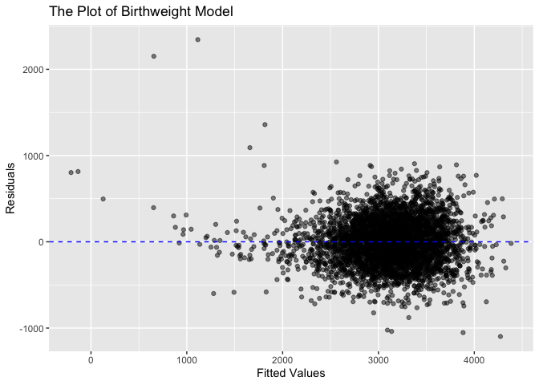

P8105_HW6_yz4717
================
Yang Zhao
2023-12-02

``` r
library(tidyverse)
```

    ## ── Attaching core tidyverse packages ──────────────────────── tidyverse 2.0.0 ──
    ## ✔ dplyr     1.1.3     ✔ readr     2.1.4
    ## ✔ forcats   1.0.0     ✔ stringr   1.5.0
    ## ✔ ggplot2   3.4.3     ✔ tibble    3.2.1
    ## ✔ lubridate 1.9.2     ✔ tidyr     1.3.0
    ## ✔ purrr     1.0.2     
    ## ── Conflicts ────────────────────────────────────────── tidyverse_conflicts() ──
    ## ✖ dplyr::filter() masks stats::filter()
    ## ✖ dplyr::lag()    masks stats::lag()
    ## ℹ Use the conflicted package (<http://conflicted.r-lib.org/>) to force all conflicts to become errors

``` r
library(modelr)
```

## Problem 2

``` r
weather_df = 
  rnoaa::meteo_pull_monitors(
    c("USW00094728"),
    var = c("PRCP", "TMIN", "TMAX"), 
    date_min = "2022-01-01",
    date_max = "2022-12-31") |>
  mutate(
    name = recode(id, USW00094728 = "CentralPark_NY"),
    tmin = tmin / 10,
    tmax = tmax / 10) |>
  select(name, id, everything())
```

    ## using cached file: /Users/yeungchiu/Library/Caches/org.R-project.R/R/rnoaa/noaa_ghcnd/USW00094728.dly

    ## date created (size, mb): 2023-09-28 10:24:38.503836 (8.524)

    ## file min/max dates: 1869-01-01 / 2023-09-30

``` r
weather_q2_df =
  weather_df |> 
  modelr::bootstrap(n = 5000) |> 
  mutate(
    modeling = map(strap, \(data) lm(tmax ~ tmin + prcp, data = data)),
    mapping = map(modeling, broom::glance),
    result = map(modeling, broom::tidy)) |>
  select(.id, result, mapping) |> 
  unnest(result, mapping) |>
  select(.id, r.squared, term, estimate) |>
  pivot_wider(
    names_from = term,
    values_from = estimate
  ) |>
  mutate(
    log_data = log(tmin * prcp)
  ) |>
  select(.id, r.squared, log_data)
```

    ## Warning: `unnest()` has a new interface. See `?unnest` for details.
    ## ℹ Try `df %>% unnest(c(result, mapping))`, with `mutate()` if needed.

    ## Warning: There was 1 warning in `mutate()`.
    ## ℹ In argument: `log_data = log(tmin * prcp)`.
    ## Caused by warning in `log()`:
    ## ! NaNs produced

``` r
head(weather_q2_df)
```

    ## # A tibble: 6 × 3
    ##   .id   r.squared log_data
    ##   <chr>     <dbl>    <dbl>
    ## 1 0001      0.899    -5.49
    ## 2 0002      0.898    -6.28
    ## 3 0003      0.902   NaN   
    ## 4 0004      0.931   NaN   
    ## 5 0005      0.912    -5.97
    ## 6 0006      0.935   NaN

Then, I would like to plot the r_squared distribution.

``` r
weather_q2_df |>
  ggplot(aes(x = r.squared)) +
  geom_density()+
  labs(x = "R_Squared",
       y = "Density",
       title = "The Density Plot of R_squared")
```

<!-- -->

As can be seen from the above graph, the distribution is approximately
normal, with the median of 0.917.

After that, I plot the distribution of
($log(\hat{\beta_1} * \hat{\beta_2})$)

``` r
weather_q2_df |>
  ggplot(aes(x = log_data)) +
  geom_density()+
  labs(x = "Log",
       y = "Density",
       title = "The Density Plot of Log Data")
```

    ## Warning: Removed 3414 rows containing non-finite values (`stat_density()`).

<!-- -->

- Confidence interval of ${r^2}$ and
  $log(\hat{\beta_1} * \hat{\beta_2})$

- Here comes the 95% CI of r_squared.

``` r
quantile(
  pull(weather_q2_df,
       r.squared),
  probs = c(.025, .975))
```

    ##      2.5%     97.5% 
    ## 0.8896321 0.9399874

- Here comes the 95% CI of $log(\hat{\beta_1} * \hat{\beta_2})$
  excluding `NULL` data.

``` r
quantile(
  pull(weather_q2_df,
       log_data),
  probs = c(.025, .975),
  na.rm = TRUE)
```

    ##     2.5%    97.5% 
    ## -8.87987 -4.54244

## Problem 3

``` r
birthweight_df =
  read_csv('data/birthweight.csv', na = c("", "NA", "Unknown"))
```

    ## Rows: 4342 Columns: 20
    ## ── Column specification ────────────────────────────────────────────────────────
    ## Delimiter: ","
    ## dbl (20): babysex, bhead, blength, bwt, delwt, fincome, frace, gaweeks, malf...
    ## 
    ## ℹ Use `spec()` to retrieve the full column specification for this data.
    ## ℹ Specify the column types or set `show_col_types = FALSE` to quiet this message.

``` r
birthweight_df =
  birthweight_df |>
  mutate(
    babysex = case_match(
             babysex,
             1 ~ "male",
             2 ~ "female"),
    frace = case_match(
             frace,
             1 ~ "White", 
             2 ~ "Black", 
             3 ~ "Asian", 
             4 ~ "Puerto Rican", 
             8 ~ "Other", 
             9 ~ "Unknown"),
    malform = case_match(
             malform,
             0 ~ "absent",
             1 ~ "present"),
    mrace = case_match(
             mrace,
             1 ~ "White", 
             2 ~ "Black", 
             3 ~ "Asian", 
             4 ~ "Puerto Rican", 
             8 ~ "Other"),
    babysex = as.factor(babysex),
    frace = as.factor(frace),
    malform = as.factor(malform),
    mrace = as.factor(mrace))

head(birthweight_df)
```

    ## # A tibble: 6 × 20
    ##   babysex bhead blength   bwt delwt fincome frace gaweeks malform menarche
    ##   <fct>   <dbl>   <dbl> <dbl> <dbl>   <dbl> <fct>   <dbl> <fct>      <dbl>
    ## 1 female     34      51  3629   177      35 White    39.9 absent        13
    ## 2 male       34      48  3062   156      65 Black    25.9 absent        14
    ## 3 female     36      50  3345   148      85 White    39.9 absent        12
    ## 4 male       34      52  3062   157      55 White    40   absent        14
    ## 5 female     34      52  3374   156       5 White    41.6 absent        13
    ## 6 male       33      52  3374   129      55 White    40.7 absent        12
    ## # ℹ 10 more variables: mheight <dbl>, momage <dbl>, mrace <fct>, parity <dbl>,
    ## #   pnumlbw <dbl>, pnumsga <dbl>, ppbmi <dbl>, ppwt <dbl>, smoken <dbl>,
    ## #   wtgain <dbl>

``` r
lm_q3 = lm(bwt ~ .,
           data = birthweight_df)

summary(lm_q3)
```

    ## 
    ## Call:
    ## lm(formula = bwt ~ ., data = birthweight_df)
    ## 
    ## Residuals:
    ##      Min       1Q   Median       3Q      Max 
    ## -1097.68  -184.86    -3.33   173.09  2344.15 
    ## 
    ## Coefficients: (3 not defined because of singularities)
    ##                     Estimate Std. Error t value Pr(>|t|)    
    ## (Intercept)       -6306.8346   659.2640  -9.566  < 2e-16 ***
    ## babysexmale         -28.7073     8.4652  -3.391 0.000702 ***
    ## bhead               130.7781     3.4523  37.881  < 2e-16 ***
    ## blength              74.9536     2.0217  37.075  < 2e-16 ***
    ## delwt                 4.1007     0.3948  10.386  < 2e-16 ***
    ## fincome               0.2898     0.1795   1.614 0.106551    
    ## fraceBlack           -6.9048    78.8349  -0.088 0.930210    
    ## fraceOther          -16.9392    97.5932  -0.174 0.862212    
    ## fracePuerto Rican   -68.2323    78.4692  -0.870 0.384599    
    ## fraceWhite          -21.2361    69.2960  -0.306 0.759273    
    ## gaweeks              11.5494     1.4654   7.882 4.06e-15 ***
    ## malformpresent        9.7650    70.6259   0.138 0.890039    
    ## menarche             -3.5508     2.8951  -1.226 0.220083    
    ## mheight               9.7874    10.3116   0.949 0.342588    
    ## momage                0.7593     1.2221   0.621 0.534418    
    ## mraceBlack          -60.0488    80.9532  -0.742 0.458266    
    ## mracePuerto Rican    34.9079    80.9481   0.431 0.666317    
    ## mraceWhite           91.3866    71.9190   1.271 0.203908    
    ## parity               95.5411    40.4793   2.360 0.018307 *  
    ## pnumlbw                   NA         NA      NA       NA    
    ## pnumsga                   NA         NA      NA       NA    
    ## ppbmi                 4.3538    14.8913   0.292 0.770017    
    ## ppwt                 -3.4716     2.6121  -1.329 0.183913    
    ## smoken               -4.8544     0.5871  -8.269  < 2e-16 ***
    ## wtgain                    NA         NA      NA       NA    
    ## ---
    ## Signif. codes:  0 '***' 0.001 '**' 0.01 '*' 0.05 '.' 0.1 ' ' 1
    ## 
    ## Residual standard error: 272.5 on 4320 degrees of freedom
    ## Multiple R-squared:  0.7183, Adjusted R-squared:  0.717 
    ## F-statistic: 524.6 on 21 and 4320 DF,  p-value: < 2.2e-16

``` r
birthweight_df |>
  add_predictions(lm_q3) |>
  add_residuals(lm_q3) |>
  ggplot(aes(x = pred,
             y = resid)) +
  geom_point(color = "black",
             alpha = .5) +
  geom_hline(yintercept = 0,
             linetype = "dashed",
             color = "blue") +
  labs(x = "Fitted",
       y = "Residuals",
       title = "The Plot of Birthweight Model")
```

    ## Warning in predict.lm(model, data): prediction from rank-deficient fit; attr(*,
    ## "non-estim") has doubtful cases

    ## Warning in predict.lm(model, data): prediction from rank-deficient fit; attr(*,
    ## "non-estim") has doubtful cases

<!-- -->
