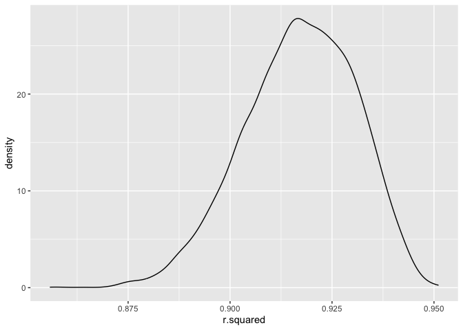

P8105_HW6_yz4717
================
Yang Zhao
2023-12-02

``` r
library(tidyverse)
```

    ## ── Attaching core tidyverse packages ──────────────────────── tidyverse 2.0.0 ──
    ## ✔ dplyr     1.1.3     ✔ readr     2.1.4
    ## ✔ forcats   1.0.0     ✔ stringr   1.5.0
    ## ✔ ggplot2   3.4.3     ✔ tibble    3.2.1
    ## ✔ lubridate 1.9.2     ✔ tidyr     1.3.0
    ## ✔ purrr     1.0.2     
    ## ── Conflicts ────────────────────────────────────────── tidyverse_conflicts() ──
    ## ✖ dplyr::filter() masks stats::filter()
    ## ✖ dplyr::lag()    masks stats::lag()
    ## ℹ Use the conflicted package (<http://conflicted.r-lib.org/>) to force all conflicts to become errors

``` r
library(modelr)
```

## Problem 2

``` r
weather_df = 
  rnoaa::meteo_pull_monitors(
    c("USW00094728"),
    var = c("PRCP", "TMIN", "TMAX"), 
    date_min = "2022-01-01",
    date_max = "2022-12-31") |>
  mutate(
    name = recode(id, USW00094728 = "CentralPark_NY"),
    tmin = tmin / 10,
    tmax = tmax / 10) |>
  select(name, id, everything())
```

    ## using cached file: /Users/yeungchiu/Library/Caches/org.R-project.R/R/rnoaa/noaa_ghcnd/USW00094728.dly

    ## date created (size, mb): 2023-09-28 10:24:38.503836 (8.524)

    ## file min/max dates: 1869-01-01 / 2023-09-30

``` r
weather_q2_df =
  weather_df |> 
  modelr::bootstrap(n = 5000) |> 
  mutate(
    modeling = map(strap, \(data) lm(tmax ~ tmin + prcp, data = data)),
    mapping = map(modeling, broom::glance),
    result = map(modeling, broom::tidy)) |>
  select(.id, result, mapping) |> 
  unnest(result, mapping) |>
  select(.id, r.squared, term, estimate) |>
  pivot_wider(
    names_from = term,
    values_from = estimate
  ) |>
  mutate(
    log_data = log(tmin * prcp)
  ) |>
  select(.id, r.squared, log_data)
```

    ## Warning: `unnest()` has a new interface. See `?unnest` for details.
    ## ℹ Try `df %>% unnest(c(result, mapping))`, with `mutate()` if needed.

    ## Warning: There was 1 warning in `mutate()`.
    ## ℹ In argument: `log_data = log(tmin * prcp)`.
    ## Caused by warning in `log()`:
    ## ! NaNs produced

``` r
head(weather_q2_df)
```

    ## # A tibble: 6 × 3
    ##   .id   r.squared log_data
    ##   <chr>     <dbl>    <dbl>
    ## 1 0001      0.912   NaN   
    ## 2 0002      0.927    -8.96
    ## 3 0003      0.915   NaN   
    ## 4 0004      0.915   NaN   
    ## 5 0005      0.933   NaN   
    ## 6 0006      0.941   NaN

Then, I would like to plot the r_squared distribution.

``` r
weather_q2_df |>
  ggplot(aes(x = r.squared)) +
  geom_density()
```

<!-- -->

As can be seen from the above graph, the distribution is approximately
normal, with the median of 0.917.

After that, I plot the distribution of
($log(\hat{\beta_1} * \hat{\beta_2})$)

``` r
weather_q2_df |>
  ggplot(aes(x = log_data)) +
  geom_density()
```

    ## Warning: Removed 3358 rows containing non-finite values (`stat_density()`).

<!-- -->
