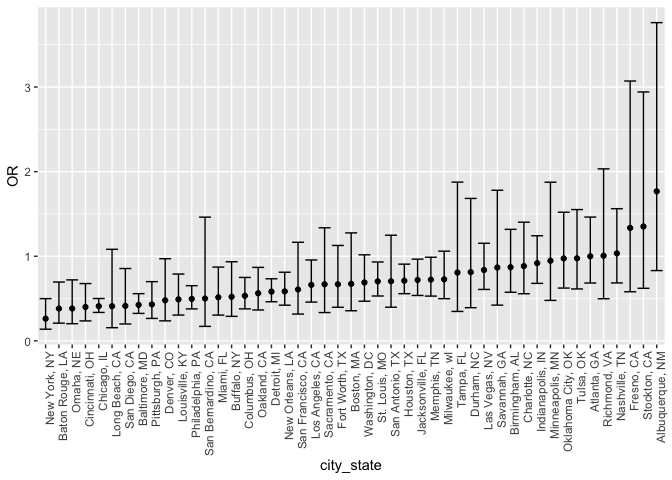
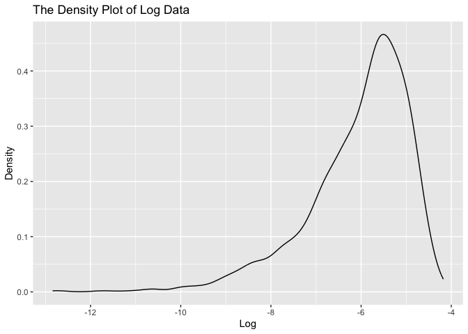

P8105_HW6_yz4717
================
Yang Zhao
2023-12-02

``` r
library(tidyverse)
```

    ## ── Attaching core tidyverse packages ──────────────────────── tidyverse 2.0.0 ──
    ## ✔ dplyr     1.1.3     ✔ readr     2.1.4
    ## ✔ forcats   1.0.0     ✔ stringr   1.5.0
    ## ✔ ggplot2   3.4.3     ✔ tibble    3.2.1
    ## ✔ lubridate 1.9.2     ✔ tidyr     1.3.0
    ## ✔ purrr     1.0.2     
    ## ── Conflicts ────────────────────────────────────────── tidyverse_conflicts() ──
    ## ✖ dplyr::filter() masks stats::filter()
    ## ✖ dplyr::lag()    masks stats::lag()
    ## ℹ Use the conflicted package (<http://conflicted.r-lib.org/>) to force all conflicts to become errors

``` r
library(modelr)
```

# Problem 1

## data cleaning

``` r
homicide= 
  read_csv("data/homicide-data.csv") |>
  mutate(
    city_state = str_c(city, state, sep = ", "),
    solve_not = case_match(
      disposition,
      "Closed without arrest" ~ 0,
      "Open/No arrest"        ~ 0,
      "Closed by arrest"      ~ 1) 
    ) |>
  filter(!(city_state %in% c("Tulsa, AL", "Dallas, TX", "Phoenix, AZ", "Kansas City, MO"))) |>
  filter(victim_race %in% c("White", "Black")) |> 
  mutate(
    victim_age = as.numeric(victim_age)
  ) |>
  select(city_state, solve_not, victim_age, victim_sex, victim_race)
```

    ## Rows: 52179 Columns: 12
    ## ── Column specification ────────────────────────────────────────────────────────
    ## Delimiter: ","
    ## chr (9): uid, victim_last, victim_first, victim_race, victim_age, victim_sex...
    ## dbl (3): reported_date, lat, lon
    ## 
    ## ℹ Use `spec()` to retrieve the full column specification for this data.
    ## ℹ Specify the column types or set `show_col_types = FALSE` to quiet this message.

    ## Warning: There was 1 warning in `mutate()`.
    ## ℹ In argument: `victim_age = as.numeric(victim_age)`.
    ## Caused by warning:
    ## ! NAs introduced by coercion

## Baltimore glm function

``` r
baltimore_glm = 
  filter(homicide, city_state == "Baltimore, MD") |> 
  glm(solve_not ~ victim_age + victim_sex + victim_race, family = binomial(), data = _)
```

## estimate and confidence interval of the adjusted odds ratio

``` r
baltimore_glm |> 
  broom::tidy() |> 
  mutate(
    OR = exp(estimate), 
    OR_CI_upper = exp(estimate + 1.96 * std.error),
    OR_CI_lower = exp(estimate - 1.96 * std.error)) |> 
  filter(term == "victim_sexMale") |> 
  select(OR, OR_CI_lower, OR_CI_upper) |>
  knitr::kable(digits = 3)
```

|    OR | OR_CI_lower | OR_CI_upper |
|------:|------------:|------------:|
| 0.426 |       0.325 |       0.558 |

## Estimated ORs and CIs for each city.

``` r
all_cities = 
  homicide |>
  nest(data = -city_state) |> 
  mutate(
    models = map(data, \(df) glm(solve_not ~ victim_age + victim_sex + victim_race, 
                             family = binomial(), data = df)),
    tidy_models = map(models, broom::tidy)) |> 
  select(-models, -data) |> 
  unnest(cols = tidy_models) |> 
  mutate(
    OR = exp(estimate), 
    OR_CI_upper = exp(estimate + 1.96 * std.error),
    OR_CI_lower = exp(estimate - 1.96 * std.error)) |> 
  filter(term == "victim_sexMale") |> 
  select(city_state, OR, OR_CI_lower, OR_CI_upper)

all_cities |>
  slice(1:5) |> 
  knitr::kable(digits = 3)
```

| city_state      |    OR | OR_CI_lower | OR_CI_upper |
|:----------------|------:|------------:|------------:|
| Albuquerque, NM | 1.767 |       0.831 |       3.761 |
| Atlanta, GA     | 1.000 |       0.684 |       1.463 |
| Baltimore, MD   | 0.426 |       0.325 |       0.558 |
| Baton Rouge, LA | 0.381 |       0.209 |       0.695 |
| Birmingham, AL  | 0.870 |       0.574 |       1.318 |

## Making plot

``` r
all_cities |> 
  mutate(city_state = fct_reorder(city_state, OR)) |> 
  ggplot(aes(x = city_state, y = OR)) + 
  geom_point() + 
  geom_errorbar(aes(ymin = OR_CI_lower, ymax = OR_CI_upper)) + 
  theme(axis.text.x = element_text(angle = 90, hjust = 1))
```

<!-- -->

In most cities, male victims have smaller odds than female victims as
the odds ratio is smaller than 1. In roughly half of these cities,
confidence intervals are narrow and do not contain 1, suggesting a
significant difference in resolution rates by sex after adjustment for
victim age and race.

# Problem 2

``` r
weather_df = 
  rnoaa::meteo_pull_monitors(
    c("USW00094728"),
    var = c("PRCP", "TMIN", "TMAX"), 
    date_min = "2022-01-01",
    date_max = "2022-12-31") |>
  mutate(
    name = recode(id, USW00094728 = "CentralPark_NY"),
    tmin = tmin / 10,
    tmax = tmax / 10) |>
  select(name, id, everything())
```

    ## using cached file: /Users/yeungchiu/Library/Caches/org.R-project.R/R/rnoaa/noaa_ghcnd/USW00094728.dly

    ## date created (size, mb): 2023-09-28 10:24:38.503836 (8.524)

    ## file min/max dates: 1869-01-01 / 2023-09-30

``` r
weather_q2_df =
  weather_df |> 
  modelr::bootstrap(n = 5000) |> 
  mutate(
    modeling = map(strap, \(data) lm(tmax ~ tmin + prcp, data = data)),
    mapping = map(modeling, broom::glance),
    result = map(modeling, broom::tidy)) |>
  select(.id, result, mapping) |> 
  unnest(result, mapping) |>
  select(.id, r.squared, term, estimate) |>
  pivot_wider(
    names_from = term,
    values_from = estimate
  ) |>
  mutate(
    log_data = log(tmin * prcp)
  ) |>
  select(.id, r.squared, log_data)
```

    ## Warning: `unnest()` has a new interface. See `?unnest` for details.
    ## ℹ Try `df %>% unnest(c(result, mapping))`, with `mutate()` if needed.

    ## Warning: There was 1 warning in `mutate()`.
    ## ℹ In argument: `log_data = log(tmin * prcp)`.
    ## Caused by warning in `log()`:
    ## ! NaNs produced

``` r
head(weather_q2_df)
```

    ## # A tibble: 6 × 3
    ##   .id   r.squared log_data
    ##   <chr>     <dbl>    <dbl>
    ## 1 0001      0.904    -6.04
    ## 2 0002      0.906   NaN   
    ## 3 0003      0.915   NaN   
    ## 4 0004      0.912    -6.70
    ## 5 0005      0.894    -5.17
    ## 6 0006      0.912    -7.14

I use the `bootstrap` to perform resampling.And I conduct the linear
regression modeling, and various data transformations on the given data
set. And I use `mutate` to calculate the needed value in the question
and `unnest` the result as well.

Then, I would like to plot the r_squared distribution.

``` r
weather_q2_df |>
  ggplot(aes(x = r.squared)) +
  geom_density()+
  labs(x = "R_Squared",
       y = "Density",
       title = "The Density Plot of R_squared")
```

<!-- -->

As can be seen from the above graph, the distribution is approximately
normal, with the median of 0.917.

After that, I plot the distribution of
($log(\hat{\beta_1} * \hat{\beta_2})$)

``` r
weather_q2_df |>
  ggplot(aes(x = log_data)) +
  geom_density()+
  labs(x = "Log",
       y = "Density",
       title = "The Density Plot of Log Data")
```

    ## Warning: Removed 3373 rows containing non-finite values (`stat_density()`).

<!-- -->

- Confidence interval of ${r^2}$ and
  $log(\hat{\beta_1} * \hat{\beta_2})$

- Here comes the 95% CI of r_squared.

``` r
quantile(
  pull(weather_q2_df,
       r.squared),
  probs = c(.025, .975))
```

    ##      2.5%     97.5% 
    ## 0.8892818 0.9404700

- Here comes the 95% CI of $log(\hat{\beta_1} * \hat{\beta_2})$
  excluding `NULL` data.

``` r
quantile(
  pull(weather_q2_df,
       log_data),
  probs = c(.025, .975),
  na.rm = TRUE)
```

    ##      2.5%     97.5% 
    ## -8.892434 -4.562035

## Problem 3

``` r
birthweight_df =
  read_csv('data/birthweight.csv', na = c("", "NA", "Unknown"))
```

    ## Rows: 4342 Columns: 20
    ## ── Column specification ────────────────────────────────────────────────────────
    ## Delimiter: ","
    ## dbl (20): babysex, bhead, blength, bwt, delwt, fincome, frace, gaweeks, malf...
    ## 
    ## ℹ Use `spec()` to retrieve the full column specification for this data.
    ## ℹ Specify the column types or set `show_col_types = FALSE` to quiet this message.

``` r
birthweight_df =
  birthweight_df |>
  mutate(
    babysex = case_match(
             babysex,
             1 ~ "male",
             2 ~ "female"),
    frace = case_match(
             frace,
             1 ~ "White", 
             2 ~ "Black", 
             3 ~ "Asian", 
             4 ~ "Puerto Rican", 
             8 ~ "Other", 
             9 ~ "Unknown"),
    malform = case_match(
             malform,
             0 ~ "absent",
             1 ~ "present"),
    mrace = case_match(
             mrace,
             1 ~ "White", 
             2 ~ "Black", 
             3 ~ "Asian", 
             4 ~ "Puerto Rican", 
             8 ~ "Other"),
    babysex = as.factor(babysex),
    frace = as.factor(frace),
    malform = as.factor(malform),
    mrace = as.factor(mrace))

head(birthweight_df)
```

    ## # A tibble: 6 × 20
    ##   babysex bhead blength   bwt delwt fincome frace gaweeks malform menarche
    ##   <fct>   <dbl>   <dbl> <dbl> <dbl>   <dbl> <fct>   <dbl> <fct>      <dbl>
    ## 1 female     34      51  3629   177      35 White    39.9 absent        13
    ## 2 male       34      48  3062   156      65 Black    25.9 absent        14
    ## 3 female     36      50  3345   148      85 White    39.9 absent        12
    ## 4 male       34      52  3062   157      55 White    40   absent        14
    ## 5 female     34      52  3374   156       5 White    41.6 absent        13
    ## 6 male       33      52  3374   129      55 White    40.7 absent        12
    ## # ℹ 10 more variables: mheight <dbl>, momage <dbl>, mrace <fct>, parity <dbl>,
    ## #   pnumlbw <dbl>, pnumsga <dbl>, ppbmi <dbl>, ppwt <dbl>, smoken <dbl>,
    ## #   wtgain <dbl>

First of all, I import the data into the environment and use the
function `mutate` and `case_match` to update the value in the data.
Then, I convert these variables into `factors`.

``` r
lm_q3 = lm(bwt ~ .,
           data = birthweight_df)

summary(lm_q3)
```

    ## 
    ## Call:
    ## lm(formula = bwt ~ ., data = birthweight_df)
    ## 
    ## Residuals:
    ##      Min       1Q   Median       3Q      Max 
    ## -1097.68  -184.86    -3.33   173.09  2344.15 
    ## 
    ## Coefficients: (3 not defined because of singularities)
    ##                     Estimate Std. Error t value Pr(>|t|)    
    ## (Intercept)       -6306.8346   659.2640  -9.566  < 2e-16 ***
    ## babysexmale         -28.7073     8.4652  -3.391 0.000702 ***
    ## bhead               130.7781     3.4523  37.881  < 2e-16 ***
    ## blength              74.9536     2.0217  37.075  < 2e-16 ***
    ## delwt                 4.1007     0.3948  10.386  < 2e-16 ***
    ## fincome               0.2898     0.1795   1.614 0.106551    
    ## fraceBlack           -6.9048    78.8349  -0.088 0.930210    
    ## fraceOther          -16.9392    97.5932  -0.174 0.862212    
    ## fracePuerto Rican   -68.2323    78.4692  -0.870 0.384599    
    ## fraceWhite          -21.2361    69.2960  -0.306 0.759273    
    ## gaweeks              11.5494     1.4654   7.882 4.06e-15 ***
    ## malformpresent        9.7650    70.6259   0.138 0.890039    
    ## menarche             -3.5508     2.8951  -1.226 0.220083    
    ## mheight               9.7874    10.3116   0.949 0.342588    
    ## momage                0.7593     1.2221   0.621 0.534418    
    ## mraceBlack          -60.0488    80.9532  -0.742 0.458266    
    ## mracePuerto Rican    34.9079    80.9481   0.431 0.666317    
    ## mraceWhite           91.3866    71.9190   1.271 0.203908    
    ## parity               95.5411    40.4793   2.360 0.018307 *  
    ## pnumlbw                   NA         NA      NA       NA    
    ## pnumsga                   NA         NA      NA       NA    
    ## ppbmi                 4.3538    14.8913   0.292 0.770017    
    ## ppwt                 -3.4716     2.6121  -1.329 0.183913    
    ## smoken               -4.8544     0.5871  -8.269  < 2e-16 ***
    ## wtgain                    NA         NA      NA       NA    
    ## ---
    ## Signif. codes:  0 '***' 0.001 '**' 0.01 '*' 0.05 '.' 0.1 ' ' 1
    ## 
    ## Residual standard error: 272.5 on 4320 degrees of freedom
    ## Multiple R-squared:  0.7183, Adjusted R-squared:  0.717 
    ## F-statistic: 524.6 on 21 and 4320 DF,  p-value: < 2.2e-16

``` r
lm_q3_original = lm(bwt ~ babysex + bhead + blength + delwt + fincome + gaweeks +mheight + momage + parity + ppwt + smoken, data = birthweight_df)

summary(lm_q3_original)
```

    ## 
    ## Call:
    ## lm(formula = bwt ~ babysex + bhead + blength + delwt + fincome + 
    ##     gaweeks + mheight + momage + parity + ppwt + smoken, data = birthweight_df)
    ## 
    ## Residuals:
    ##      Min       1Q   Median       3Q      Max 
    ## -1084.71  -182.26    -5.31   176.63  2515.55 
    ## 
    ## Coefficients:
    ##               Estimate Std. Error t value Pr(>|t|)    
    ## (Intercept) -6594.3602   134.3232 -49.093  < 2e-16 ***
    ## babysexmale   -30.8363     8.6229  -3.576 0.000353 ***
    ## bhead         134.1786     3.5000  38.337  < 2e-16 ***
    ## blength        77.5829     2.0520  37.808  < 2e-16 ***
    ## delwt           4.0049     0.4018   9.967  < 2e-16 ***
    ## fincome         1.0381     0.1739   5.971 2.55e-09 ***
    ## gaweeks        12.7861     1.4917   8.571  < 2e-16 ***
    ## mheight         7.9122     1.7868   4.428 9.74e-06 ***
    ## momage          4.1638     1.1743   3.546 0.000396 ***
    ## parity         93.0619    41.2899   2.254 0.024254 *  
    ## ppwt           -2.9054     0.4403  -6.599 4.65e-11 ***
    ## smoken         -2.8032     0.5775  -4.854 1.25e-06 ***
    ## ---
    ## Signif. codes:  0 '***' 0.001 '**' 0.01 '*' 0.05 '.' 0.1 ' ' 1
    ## 
    ## Residual standard error: 278 on 4330 degrees of freedom
    ## Multiple R-squared:  0.7061, Adjusted R-squared:  0.7053 
    ## F-statistic: 945.5 on 11 and 4330 DF,  p-value: < 2.2e-16

At first, I have used all the variables in the data set as predictors.
Then, I reviewed the summary result and check the p-values of all
predictors. As we known, to make the adjusted r-squared higher, I need
to drop the insignificant variables in the original model. Repeat this
step, until all predictors have a p-value less than 0.05.

``` r
birthweight_df |>
  add_predictions(lm_q3) |>
  add_residuals(lm_q3) |>
  ggplot(aes(x = pred,
             y = resid)) +
  geom_point(color = "black",
             alpha = .5) +
  geom_hline(yintercept = 0,
             linetype = "dashed",
             color = "blue") +
  labs(x = "Fitted Values",
       y = "Residuals",
       title = "The Plot of Birthweight Model")
```

    ## Warning in predict.lm(model, data): prediction from rank-deficient fit; attr(*,
    ## "non-estim") has doubtful cases

    ## Warning in predict.lm(model, data): prediction from rank-deficient fit; attr(*,
    ## "non-estim") has doubtful cases

<!-- -->

Most points gathered in the region of 2000-4000 fitted values and
-1000-1000 residuals. These dots are gathered into a cluster. A small
number of points are distributed far away from the cluster in the
periphery of the cluster.

## Length at birth and gestational age

``` r
set.seed(123)

lm_q3_1 = 
  lm(bwt ~ blength + gaweeks,
              data = birthweight_df)

summary(lm_q3_1)
```

    ## 
    ## Call:
    ## lm(formula = bwt ~ blength + gaweeks, data = birthweight_df)
    ## 
    ## Residuals:
    ##     Min      1Q  Median      3Q     Max 
    ## -1709.6  -215.4   -11.4   208.2  4188.8 
    ## 
    ## Coefficients:
    ##              Estimate Std. Error t value Pr(>|t|)    
    ## (Intercept) -4347.667     97.958  -44.38   <2e-16 ***
    ## blength       128.556      1.990   64.60   <2e-16 ***
    ## gaweeks        27.047      1.718   15.74   <2e-16 ***
    ## ---
    ## Signif. codes:  0 '***' 0.001 '**' 0.01 '*' 0.05 '.' 0.1 ' ' 1
    ## 
    ## Residual standard error: 333.2 on 4339 degrees of freedom
    ## Multiple R-squared:  0.5769, Adjusted R-squared:  0.5767 
    ## F-statistic:  2958 on 2 and 4339 DF,  p-value: < 2.2e-16

## Head circumference, length, sex, and all interactions

``` r
lm_q3_2  =  
  lm(bwt ~ babysex + blength + bhead + + bhead * blength + bhead * babysex + blength * babysex, 
     data = birthweight_df)

summary(lm_q3_2)
```

    ## 
    ## Call:
    ## lm(formula = bwt ~ babysex + blength + bhead + +bhead * blength + 
    ##     bhead * babysex + blength * babysex, data = birthweight_df)
    ## 
    ## Residuals:
    ##     Min      1Q  Median      3Q     Max 
    ## -1133.8  -189.7    -7.2   178.8  2721.8 
    ## 
    ## Coefficients:
    ##                       Estimate Std. Error t value Pr(>|t|)    
    ## (Intercept)         -3508.3263   820.5298  -4.276 1.95e-05 ***
    ## babysexmale          -259.9785   197.9105  -1.314  0.18904    
    ## blength                35.7217    17.4013   2.053  0.04015 *  
    ## bhead                  66.8435    25.4407   2.627  0.00863 ** 
    ## blength:bhead           1.5608     0.5269   2.962  0.00307 ** 
    ## babysexmale:bhead      12.6620     7.0450   1.797  0.07236 .  
    ## babysexmale:blength    -4.2107     4.1691  -1.010  0.31257    
    ## ---
    ## Signif. codes:  0 '***' 0.001 '**' 0.01 '*' 0.05 '.' 0.1 ' ' 1
    ## 
    ## Residual standard error: 288.1 on 4335 degrees of freedom
    ## Multiple R-squared:  0.6839, Adjusted R-squared:  0.6835 
    ## F-statistic:  1563 on 6 and 4335 DF,  p-value: < 2.2e-16

## Comparison

### Original Model

``` r
cv_model = crossv_mc(birthweight_df, 100)

errors_original_df = map2_dbl(
  pull(cv_model,train),
  pull(cv_model,test), 
  ~{
  model1_fit = lm(bwt ~ babysex + bhead + blength + delwt + fincome + gaweeks + mheight + momage + parity + ppwt + smoken,
                  data = birthweight_df)
  rmse(model1_fit, .y)
  })

error_original = mean(errors_original_df)
```

## Model 1 & Model 2

``` r
# model 1
errors_model1_df = 
  map2_dbl(
  pull(cv_model,train),
  pull(cv_model,test), 
  ~{
  model1_fit = lm(bwt ~ blength + gaweeks, data = .x)
  rmse(model1_fit, .y)
  })

error_model1 = mean(errors_model1_df)

# model 2
errors_model2_df = 
  map2_dbl(
  pull(cv_model,train),
  pull(cv_model,test),  
  ~{
  model2_fit = lm(bwt ~ bhead + blength + babysex + bhead * blength + bhead * babysex + blength * babysex, data = .x)
  rmse(model2_fit, .y)
})

error_model2 = mean(errors_model2_df)
```

We can use `crossv_mc` to split the data into k exclusive partitions and
uses each partition for a test-training split. Then, I built three
different models as requested in the question and computed their error.

``` r
tibble(
  "original" = error_original,
  "model_1" = error_model1,
  "model_2" = error_model2
) |> 
  knitr::kable()
```

| original |  model_1 |  model_2 |
|---------:|---------:|---------:|
| 277.2568 | 330.7093 | 288.6215 |

From the lessons we already have, we can know that Error can be used to
compare different models. According to the given result, we can clearly
see the optimized original model have the lowest Error while the other
model perform badly.
